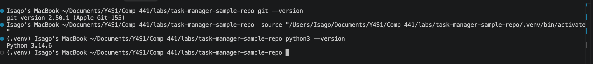
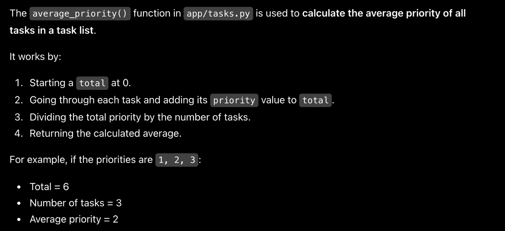

  ---------------------------------------------------------------------------
  ID           File          Line         Description           Suspected
                                                                Severity
  ------------ ------------- ------------ --------------------- -------------
  01           Tasks.py      48           get_pending_tasks()   Major
                                          starts at index 1     
                                          instead of index 0    
                                          causing the first     
                                          task to be skipped    

  02           Tasks.py      59           average_priority()    Medium
                                          divides by the number 
                                          of tasks without      
                                          checking if the list  
                                          is empty              
                                          (ZeroDivisionError)   

  03           Tasks.py      26           IDs are generated     Major
                                          using len(tasks) + 1  
                                          and if a task is      
                                          deleted a new task    
                                          could receive an ID   
                                          that already exists   

  04           Storage.py    4            An API key is hard    Low
                                          coded in the source   
                                          code                  

  05           Tasks.py      11-13        The task file is      Low
                                          opened but never      
                                          closed                

  06           Storage.py    26           The title filter is   Major
                                          directly inserted     
                                          into the SQL query    
                                          (potential SQL        
                                          injection             
                                          vulnerability)        

  07           Tasks.py      23           add_task() uses a     Medium
                                          mutable list as the   
                                          default value for     
                                          tags which can cause  
                                          the same list to be   
                                          shared between        
                                          multiple function     
                                          calls                 

  08           Storage.py    11           The task ID is        Major
                                          concatenated with     
                                          strings which can     
                                          cause a type error.   
  ---------------------------------------------------------------------------

Key:

- **Critical: **System crash or complete failure; further testing cannot
  continue.

<!-- -->

- **Major: **A major feature fails, but the rest of the application
  remains usable.

- **Medium: **A functional issue with a temporary workaround available.

- {width="7.659574584426947in"
  height="1.7340277777777777in"}**Low: **A minor issue with little or no
  impact on functionality.

{width="6.268055555555556in"
height="2.877083333333333in"}

The existing test suite was executed using pytest. A total of six tests
were collected with four tests passing and two tests failing.

The failures:

- get_pending_tasks() where the first task is skipped.

- average_priority() where a division-by-zero error occurs when
  average_priority() is called with an empty list.

Reflection

Some of the defects identified during manual inspection would likely be
detected quickly by automated tests while others would require careful
examination of the source code.

The defects 01 and 02 are likely to be detected by automated tests
because both produce observable incorrect behaviour. The existing test
suite confirmed both of these defects. A test that checks whether all
pending tasks are returned can expose defect 01 while a test using an
empty task list can expose defect 02.

The defect 03 may require a more specific automated test involving the
creation and deletion of tasks. A general test suite might not detect it
unless that particular scenario is covered.

The vulnerability of defect 06 and 04 are issues that require more
careful security-oriented analysis. Some specialised security scanners
may detect them but a basic linter or functional tests may not identify
the security risks.

The defect 07 could potentially be detected by a linter such as Pylint
although its actual impact would depend on how the function is used. The
defect 05 could also potentially be identified by static analysis tools
that check resource management.

The defect 08 could be detected by an automated test if the function is
executed with the normal integer task IDs. However without a test
covering report generation it could remain unnoticed.
